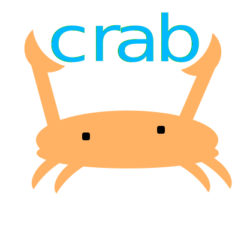

  

The most concise description for this library would be "Templated library focused on improving specific parts of the
STL, specifically a prioritization on type invariance, error handling, and readability"

I am working on better documentation for this library starting with doxygen, which can be
found [here](https://bishan-batel.github.io/crab). Please note that this documentation is *incomplete* and is being
worked on right now. Even though nobody reads doxygen documentation, I am still trying to comprehensively document
everything in crab. After this is done, a better wiki for crab features will be made with proper examples and guides (
similar to module-level documentation in rust).

I joke that this is a 'rust fanfic' library, must the goal is to not dilute rust's language features in metatemplate
hacks, but to turn many concepts and reframe them to concepts I think are digestible to how many people treat and use
C++. We have our own `Option<T>` type in crab for error handling and ergonomic APIs, but what we will never have are
complex macros to try to impose *"""safety 🚀🤪"""*.

