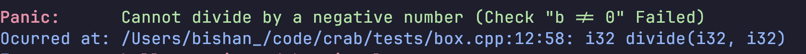
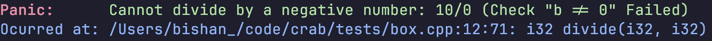

# Checks

Checks in crab are analogous to 'assert' with a more expressive API. When you use a check, you are stating a condition that *must be true* else behavior is undefined. If the check is false - then the program will [panic](/pages/reference/assert/Panic) and exit.

```cpp 
auto divide(i32 a, i32 b) -> i32 {

    crab_check(b != 0, "Cannot divide by a negative number");

    return a / b;
}
```


Unlike asserts, `crab_check` will still exist in release mode as well for easier debugging rather than allowing undefined behavior. For parts of your codebase where this is not desireable (ie. performance critical), 

```cpp 
auto divide(i32 a, i32 b) -> i32 {

    // check is only performed in debug mode
    crab_dbg_check(b != 0, "Cannot divide by a negative number");

    return a / b;
}
```

While adding messages to your checks is *heavily encouraged*, they can be omitted leaving the panic with an empty message.

```cpp 
auto divide(i32 a, i32 b) -> i32 {

    crab_check(b != 0);
    crab_dbg_check(b != 0);

    return a / b;
}
```


When a check fails, the output will look something like this:

?> 


If you wish to include more information in your check, the message provided can be used as a `fmt` / `std::format` format string.
```cpp 
auto divide(i32 a, i32 b) -> i32 {
  // check is only performed in debug mode
  crab_check(b != 0, "Cannot divide by a negative number: {}/{}", a, b);


If you wish to include more information in your check, the message provided can be used as a `fmt` / `std::format` format string.
```cpp 
auto divide(i32 a, i32 b) -> i32 {
  // check is only performed in debug mode
  crab_check(b != 0, "Cannot divide by a negative number: {}/{}", a, b);

  return a / b;
}
```

The output will look like this:

?> 


Something to note is everything after the first condition for `crab_check` *is only evaluated if the check failed*, so you can put more expensive string functions as format parameters and not worry about them being called everytime.
